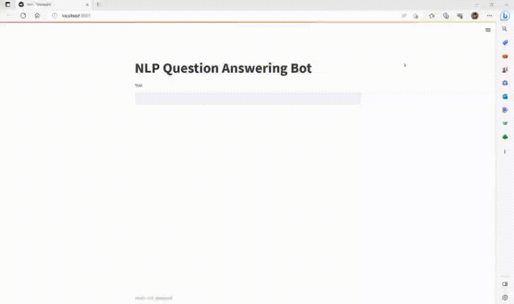
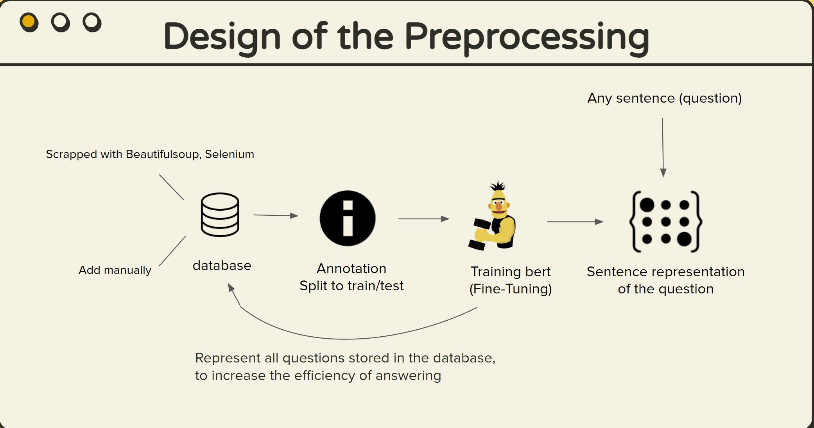
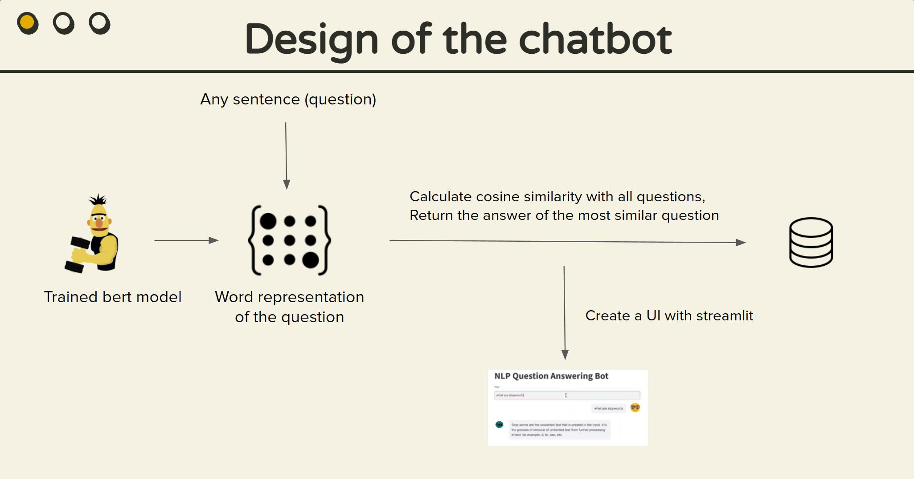

# NLPchatbot

This chatbot has been developed specifically to answer questions related to natural language processing. To do so, it utilizes the sentence representations generated by a pre-trained BERT model that has undergone fine-tuning, as well as cosine similarity, to provide accurate and relevant responses.

This project consists of two main components: a user-friendly software interface developed using Streamlit, allowing users to interact with the chatbot in a seamless and intuitive manner; and an API that enables users to input a question and receive a corresponding answer from the bot.



# Program flow




# Requirment
Github do not allow to upload large files. To use the software and the api, dowanload the folder from https://drive.google.com/drive/folders/1KIH-ylWz-Klg9eBgJNMfOa3QlTv1pIqq. and put them to `/chatbot_api/IR_qa_model` and `/chatbot_software/IR_qa_model`

Besides, a .yml file is provide to help you install the packages used in this project.

# Usage

## Software
```
# Go into the project folder
cd chatbot_software
streamlit run bot.py 
```

## API
```
# run the following code
python main.py -q <questions>
```

## Example conversation
```
You: What are n-grams
Bot: N-grams are the continuous sequence (similar to the power set in number theory) of n-tokens of a given text.
You: What are stop words
Bot: Stop words are the unwanted text that is present in the input. It is the process of removal of unwanted text from further processing of text, for example, a, to, can, etc.
```


# FAQ
## Why not use the embeddings from the last five layers of the original bert?
Traditionally, the average of results from the last five hidden layers has been used to obtain meaningful sentence embeddings. However, after experimenting with this approach and comparing it to the results obtained from a fine-tuned model, we found that fine-tuning provided superior performance.

## Why are database stored in pkl and not CSV?
If we store our database in CSV format, the machine will not recognize that the data is in tensor format. This will prevent us from being able to accurately calculate the similarity between the input and our data.

# Limitation
Due to limited resources, we were only able to collect 1387 instances for our dataset. Compared to the well-known SQuAD dataset, which contains 300k examples, this is a relatively small sample size. 

Additionally, our current solution is based on information retrieval, which means the bot is only able to answer questions that are included in the database. It is not capable of generating novel responses to previously unseen questions.


# Future Work
Although we compared the performance of different embeddings, we did not use a statistical method as a baseline for comparison. Additionally, techniques such as POS-tagging may further enhance the project's performance.

# Reference
[1] Data Science Stack Exchange. (n.d.). NLP tag page. Retrieved May 3, 2023, from https://datascience.stackexchange.com/questions/tagged/nlp?tab=votes&page=

[2] AnalytixLabs. (n.d.). Blog. Retrieved May 3, 2023, from https://www.analytixlabs.co.in/blog/
